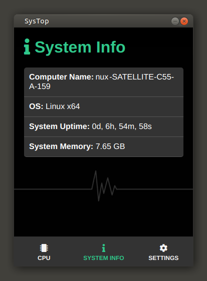

# Electron SysTop App

This is a simple miniproject I'm doing whilst following a course on Electron ( [Electron From Scratch: Build Desktop Apps With JavaScript by Brad Traversy](https://www.udemy.com/course/electron-from-scratch/) ).
\
\
The result is a simple desktop application implemented using HTML,CSS and Javascript alongsize Nodejs and Electron which allows monitors your CPU usage and notifies you if it surpasses a specific treshold (which is configurable).
\
\
&NewLine;

### ScreenShots

&NewLine;

- CPU Panel:

    

 

- System Info Panel :

    

 

- Settings Panel :

    

 

- Nofitication Example :

    

\
\
&NewLine;

### Installer

Since I developed the application on an Ubuntu machine I could only produce an installer for Debian systems (building the application for other systems should however be streightforward),
you can find the deb file at [/installers/systop_1.0.0_amd64.deb](https://github.com/dario-piotrowicz/Electron_SysTop/blob/master/installers/systop_1.0.0_amd64.deb).
